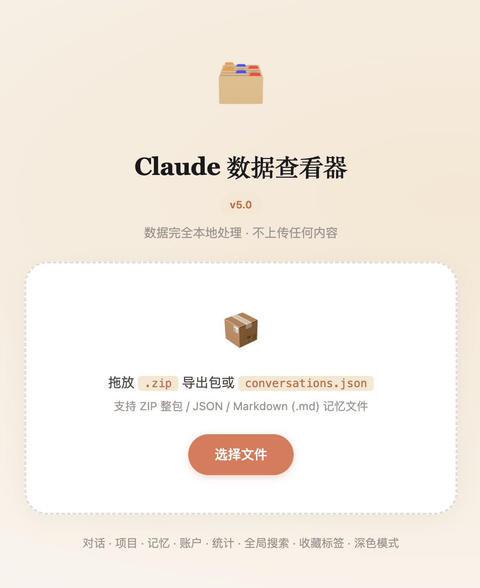
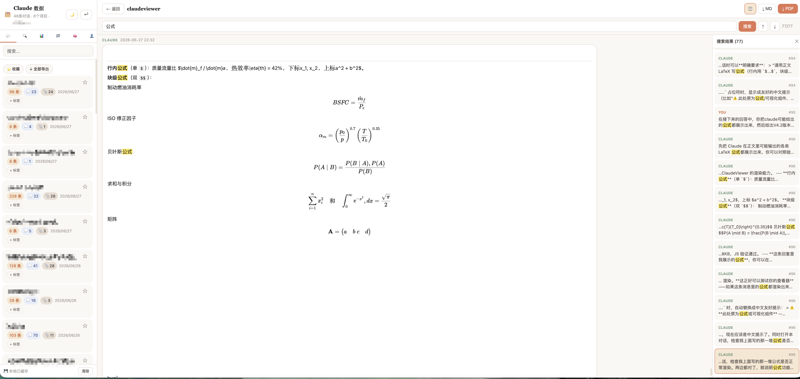
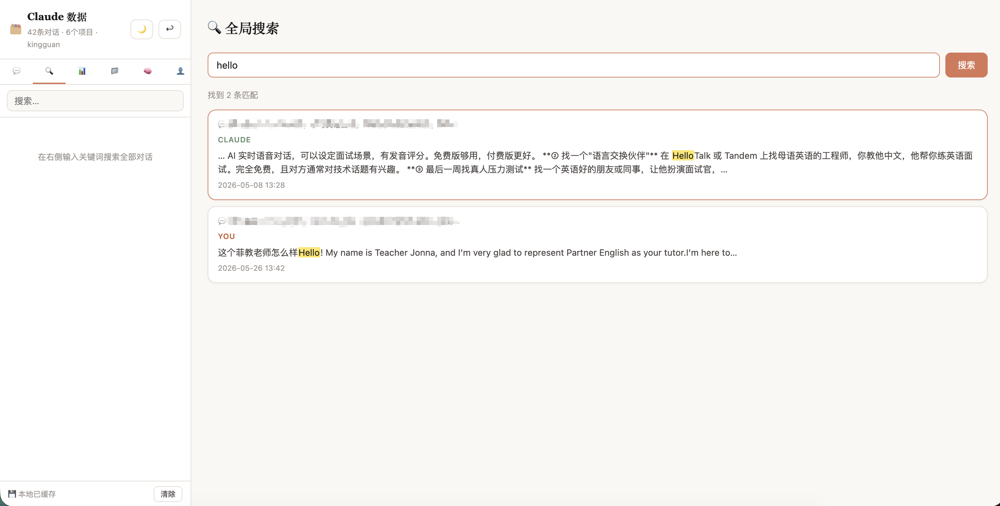
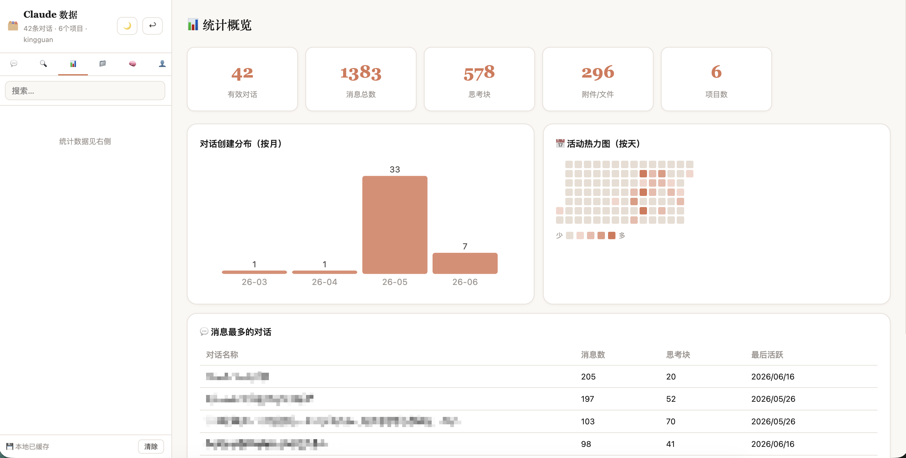
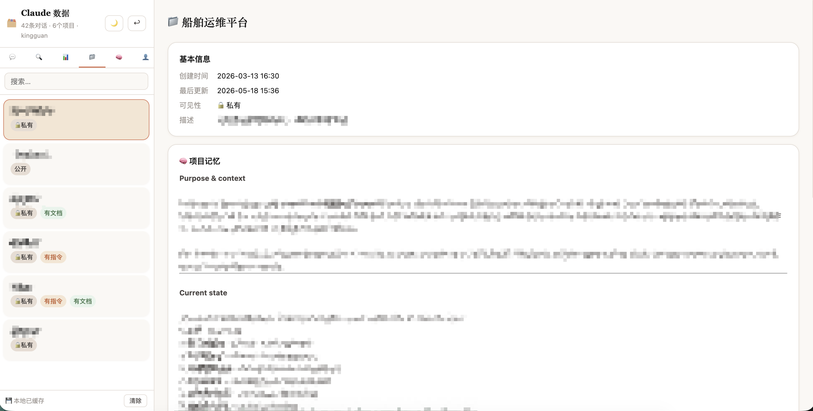

# 🗂️ Claude Data Viewer v5.2

[简体中文](README.md) · **English**

> Runs locally · Zero install · Your data never leaves your device

A single-file HTML tool for viewing and analyzing your personal data exported from Claude.ai. Double-click to use — no server, no network, no account required. **Since v5.2, all dependencies are inlined into the single file, so it works fully offline with zero external requests.**

🔗 **Live demo**: <https://crownleo.github.io/ClaudeViewer/claude_viewer.html>
📥 **Download**: [latest release](https://github.com/crownleo/ClaudeViewer/releases/latest)　·　🗺️ [Roadmap](docs/ROADMAP.md)



> The live demo also runs entirely in your browser and uploads nothing. For long-term use, [download the single file](https://github.com/crownleo/ClaudeViewer/releases/latest) and keep it offline.

---

## ✨ Features

### Data Import
| Method | Notes |
|---|---|
| Drop `.zip` | Auto-parses all JSON inside the archive in one step |
| Drop / pick `.json` | Multiple files at once supported |
| Drop / pick `.md` | Import custom global-memory files |
| Auto-filter empty chats | Conversations with no message content are hidden |
| Local persistent cache | Optionally save to the browser to skip re-importing next time |

### Conversation Viewing
| Feature | Notes |
|---|---|
| Human / Assistant bubbles | Human right-aligned (sand color), Claude left-aligned (white, bordered) |
| Full timestamps | Every message shows YYYY-MM-DD HH:MM |
| Markdown rendering | Headings, code blocks, tables, quotes, etc. fully supported |
| LaTeX rendering | Inline `$...$` and block `$$...$$` formulas (KaTeX) |
| One-click code copy | Copy button on each code block, shown on hover |
| Thinking blocks | Collapsed by default, click to expand; light italic style |
| Attachment display | Filename badge + collapsible txt/py/md content |
| Jump to top/bottom | Floating buttons in the message area for long chats |
| Hybrid rendering | ≤500 messages render all at once (smooth + Ctrl+F); longer chats auto virtual-scroll |

### Search
| Feature | Notes |
|---|---|
| In-conversation search | Keyword highlight, ↑↓ occurrence-level navigation, match count |
| Search-result sidebar | See all hits at a glance, click to jump |
| Global search | Full-text search across all conversations, click to locate the exact message |
| Title filter | Live filtering at the top of the conversation list |

### Data Management
| Feature | Notes |
|---|---|
| ⭐ Favorites | Star conversations, filter by "favorites only" |
| 🏷 Tags | Custom tag classification, multi-tag filtering, persisted |
| 📋 One-click copy | Copy message / thinking / attachment content |

### Statistics & Analysis
| Feature | Notes |
|---|---|
| Overview | Conversation / message / thinking-block / attachment / project counts |
| Monthly bar chart | Distribution of conversation creation time |
| Activity heatmap | Per-day heatmap, hover to inspect, click to filter that day's chats |
| Message ranking | Top 10 conversations by message count, click to open |

### Multi-type Data
| Tab | Source | Content |
|---|---|---|
| 💬 Conversations | `conversations.json` | Messages, thinking, attachments |
| 🔍 Global Search | All conversations | Cross-conversation full-text search |
| 📊 Statistics | All conversations | Analysis & visualization |
| 📁 Projects | `projects/*.json` | System prompt, docs, **project memory** |
| 🧠 Memory | `.md` import | **Global memory** (manual export/import) |
| 👤 Account | `users.json` | Basic info & stats |

### Export
| Feature | Action | Output |
|---|---|---|
| Export current chat as Markdown | Detail page "↓ MD" | `.md` file with thinking blocks and attachments |
| Export current chat as PDF | Detail page "↓ PDF" | New window → print → save as PDF (with formulas) |
| Batch export all chats | List page "↓ Export All" | `.zip`, one MD file per conversation |
| Export memory file | Memory tab "↓ Export" | `.md` file |

### Interface
| Feature | Notes |
|---|---|
| 🌙 Dark mode | One-click toggle, Claude warm dark theme, state persisted |
| Top nav bar | Current conversation name + back button |

---

## 📸 Screenshots

| Main page · conversation view | Global search |
|---|---|
|  |  |
| **Statistics** | **Projects** |
|  |  |

---

## 🚀 Quick Start

### Step 1: Get your Claude export
1. Open [claude.ai](https://claude.ai) and sign in
2. Avatar → **Settings** → **Privacy** → **Export data**
3. Click **Export** and wait for the email (usually within minutes)
4. Download the `.zip` from the email

### Step 2: Open the viewer
Double-click `claude_viewer.html` to open it in your browser.

> **Recommended browsers**: Chrome / Edge
> Safari can view conversations fine, but PDF export is limited.

### Step 3: Import your data
**Drag the `.zip` directly** onto the page to parse everything automatically. After a successful import you can choose whether to save it locally.

---

## 🧮 About LaTeX Rendering

ClaudeViewer renders the **LaTeX text Claude writes in the message body**:

| Form | Rendered? |
|---|---|
| Inline `$...$`, `\(...\)` | ✅ Rendered |
| Block `$$...$$`, `\[...\]` | ✅ Rendered |
| ` ```latex ` code blocks | ⚪ Shown as source (code blocks aren't rendered, as expected) |
| Special widget/visualization blocks | ❌ No source in export, shows a friendly notice |

> To ensure formulas display in your export, you can ask Claude to "write formulas as body LaTeX, not as code blocks or visualization widgets."

---

## ⌨️ Keyboard Shortcuts

| Action | Shortcut |
|---|---|
| Run in-conversation search | `Enter` |
| Jump to next result | `Enter` (when results exist) |
| Run global search | `Enter` (in the global search box) |
| Confirm adding a tag | `Enter` |
| Cancel adding a tag | `Escape` |

---

## 🔒 Privacy

- **Fully local**: all data is processed only in your browser, never sent to any server
- **Zero external requests**: since v5.2, marked.js, JSZip, KaTeX and its fonts are all inlined into the single file — opening the page makes no request to any CDN or third party, and it works fully offline
- **No persistence by default**: unless you explicitly choose "save locally"
- **IndexedDB cache**: if you save, data lives in this device's browser, readable only locally, clearable anytime
- **localStorage**: favorites, tags, dark mode, cache preference (no conversation content)

---

## 📦 Tech Stack

- Vanilla HTML / CSS / JavaScript, no framework
- [marked.js 9.1.6](https://marked.js.org/) — Markdown rendering (inlined)
- [JSZip 3.10.1](https://stuk.github.io/jszip/) — ZIP parsing & generation (inlined)
- [KaTeX 0.16.9](https://katex.org/) — LaTeX rendering, fonts included (inlined)
- Dependency inlining: third-party libs and KaTeX fonts are inlined into the single file via [`build/build.py`](build/build.py), zero CDN, fully offline; re-run the script to upgrade a dependency
- Hybrid rendering: full render ≤500 / virtual scroll for long chats (absolute positioning + requestAnimationFrame)
- Charts / heatmap: inline SVG + DOM, no third-party chart library
- Local persistence: IndexedDB
- Dark mode: CSS variables + `data-theme` toggle

---

## 🌐 Browser Compatibility

| Browser | Viewing | PDF Export | Local Cache | Recommended |
|---|---|---|---|---|
| Chrome 90+ | ✅ | ✅ | ✅ | ⭐ Best |
| Edge 90+ | ✅ | ✅ | ✅ | ✅ |
| Firefox 88+ | ✅ | ✅ | ✅ | ✅ |
| Safari (Mac) | ✅ | ⚠️ Limited | ✅ | — |

> **Safari note**: Safari sometimes auto-unzips downloaded ZIPs. If so, right-click the extracted folder → Compress, or disable "Open safe files after downloading" in Safari settings.
> **Local cache note**: When opened from local `file://`, Chrome/Edge treat all local files as one origin, sharing a single IndexedDB (moving/renaming the file keeps data, but isolation between local HTML files is weak). Firefox differs. For long-term storage, back up with "↓ Export All".

---

## 📁 Export Package Files

| File | Content |
|---|---|
| `conversations.json` | All conversations (messages, timestamps, thinking, attachments) |
| `users.json` | Basic account info |
| `memories.json` | Project memory data (view under the corresponding project in the "Projects" tab) |
| `projects/{uuid}.json` | Project metadata (name, system prompt, docs) |

> Global memory is what Claude remembers about you across conversations. It isn't in the standard export — export it separately as `.md` from the Claude UI and import it into the viewer's "Memory" tab.

---

## 📋 Version History

**v5.2** — **Dropped CDN, all dependencies inlined.** marked.js, JSZip, KaTeX and its fonts are bundled into the single file: zero external requests on load, fully offline, and it fixes the slow/failed CDN loads some networks experienced. The project is now licensed under **GPL-3.0**, with author attribution and a copyright notice added to the cover and the running UI.

**v5.1** — Added **one-click copy** (message / thinking / attachment) and **spacing improvements** (no overlapping messages, full thinking display), keeping v5.0's occurrence-level search and local persistence.

**v5.0** — Stable consolidation release. On top of all v4 features, includes LaTeX rendering, hybrid rendering, occurrence-level search, and friendly notices for unsupported blocks, as a major milestone.

Core capabilities:
- Viewing: ZIP/JSON/MD import, conversations/projects/memory/account, hybrid rendering, thinking, attachments, code copy, LaTeX
- Search: in-conversation occurrence-level search + result sidebar + global search
- Statistics: overview cards, monthly bar chart, daily activity heatmap (click to filter), message ranking
- Management: favorites, tags, dark mode, IndexedDB persistence
- Export: single Markdown/PDF (with formulas), batch ZIP of all conversations

> Evolution: v1 conversation viewing & virtual scroll → v2 ZIP import & multi-type data → v3 global search & statistics → v4 search sidebar, heatmap, local persistence, LaTeX, hybrid rendering → v5 stable consolidation → v5.1 one-click copy & spacing → v5.2 drop CDN, inline dependencies.

---

## 🗺️ Roadmap

Curious about where the project is headed? See the [**Roadmap**](docs/ROADMAP.md), and feel free to share ideas in [Issues](https://github.com/crownleo/ClaudeViewer/issues).

---

## ⭐ Star History

If this tool helps you, a Star would mean a lot ⭐

[](https://star-history.com/#crownleo/ClaudeViewer&Date)

---

## 📄 License & Attribution

[](LICENSE)

This project is open source under the [GNU GPL-3.0](LICENSE). You are free to use, study, modify, and redistribute it, but **you must keep the copyright notice and author attribution**, and derivative works must also be licensed under GPL-3.0.

- Author: **crownleo**　·　Xiaohongshu: **kingguan4**
- GitHub: <https://github.com/crownleo/> (reach out via [Issues](https://github.com/crownleo/ClaudeViewer/issues))

© 2025 crownleo · Released under GPL-3.0

---

*Claude Data Viewer v5.2 · Your data, under your control*
