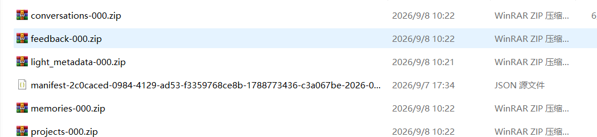
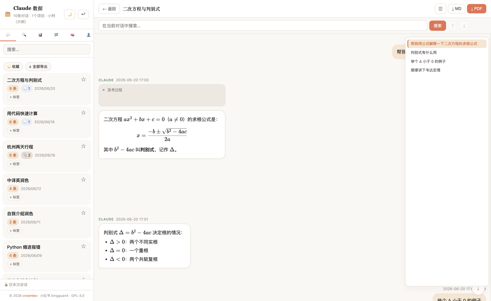
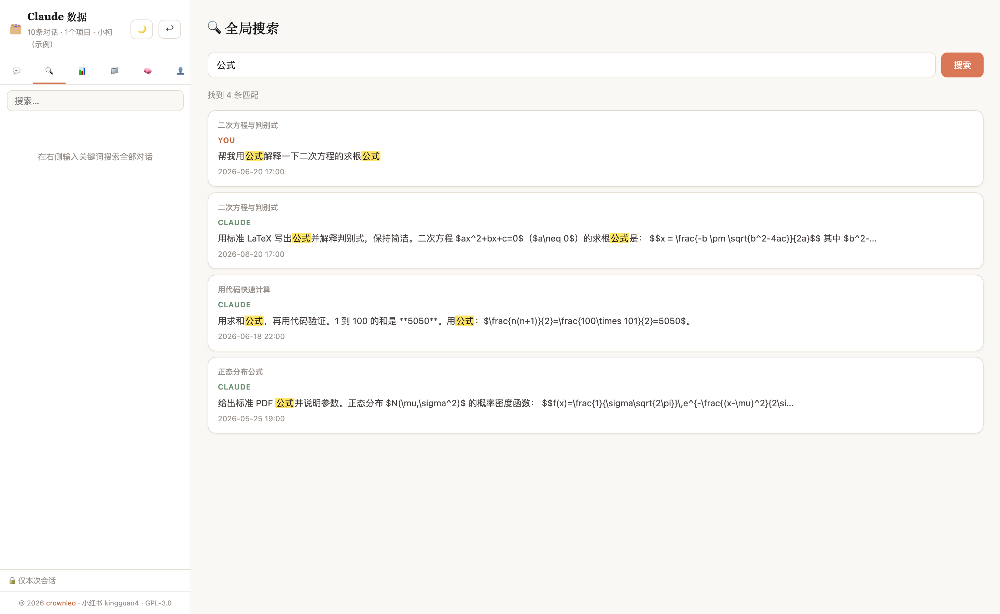
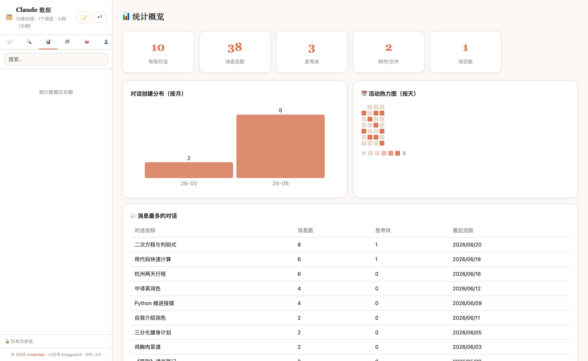
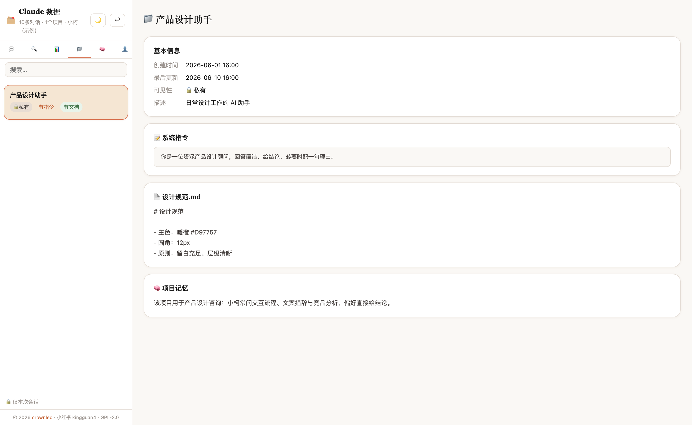
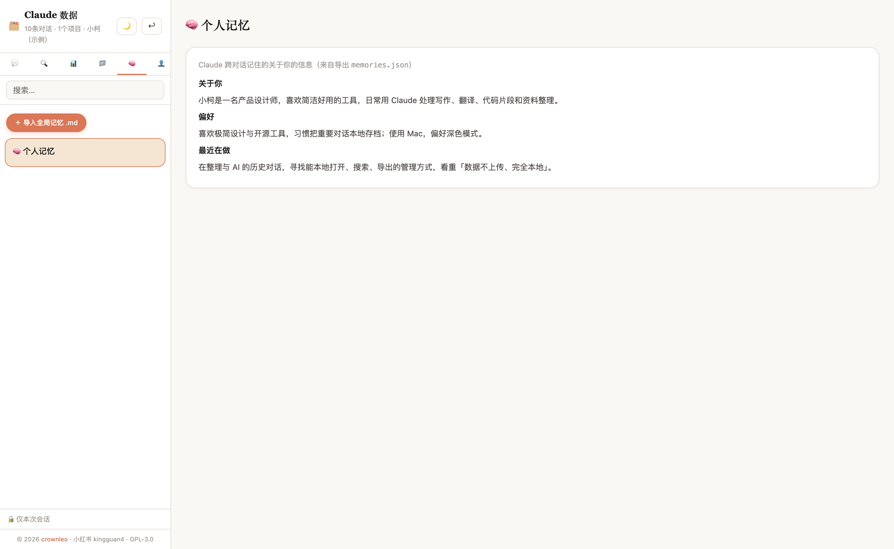
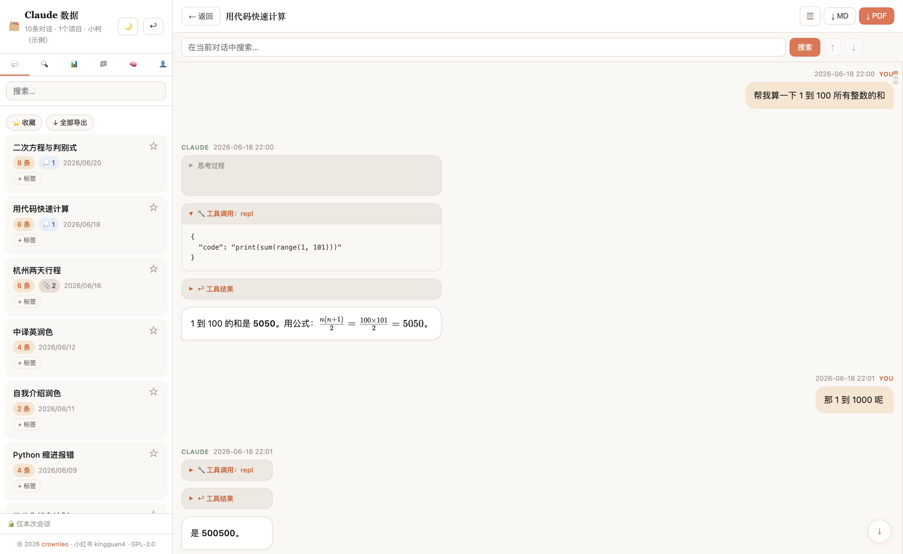
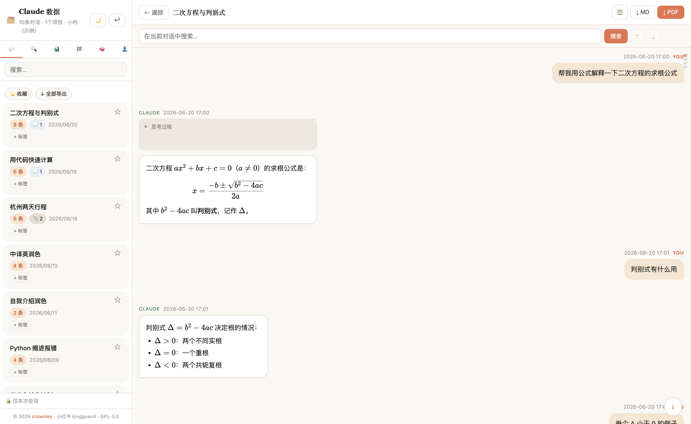
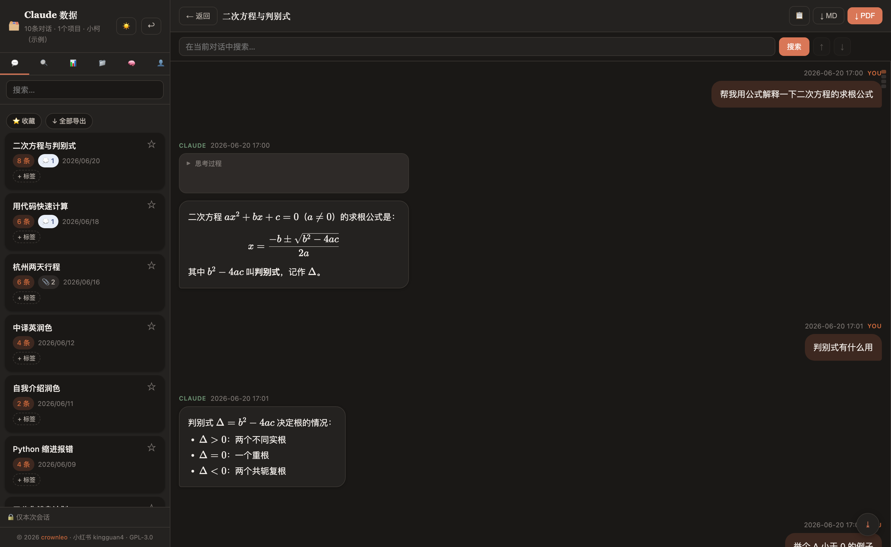

# 🗂️ Claude Data Viewer v6.0

[简体中文](README.md) · **English**

> Runs locally · Zero install · Your data never leaves your device

A single-file HTML tool for viewing and analyzing your personal data exported from Claude.ai. Double-click to use — no server, no network, no account required. **Since v5.2, all dependencies are inlined into the single file, so it works fully offline with zero external requests.**

🔗 **Live demo**: <https://claudeviewersite.crownleo.cn/>
📥 **Download**: [latest release](https://github.com/crownleo/ClaudeViewer/releases/latest)　·　🗺️ [Roadmap](docs/ROADMAP.md)

<p align="center"></p>

> The live demo also runs entirely in your browser and uploads nothing. For long-term use, [download the single file](https://github.com/crownleo/ClaudeViewer/releases/latest) and keep it offline.

---

## 🚀 Quick Start

### Step 1: Export your data from Claude

1. Open [claude.ai](https://claude.ai) and sign in
2. Avatar → **Settings** → **Privacy** → **Export data**
3. Click **Export** and wait for the email (usually within minutes)
4. The email gives you a **`manifest-….json`** listing **5 download links** — download **all five files**

> ⚠️ **Each link in the manifest works only once.** Download all five in one go; a missing file cannot be re-fetched and forces a fresh export.

### Step 2: Put everything into one folder

**Keep the 5 `.zip` files and the `manifest-….json` together — do not delete the manifest.**



The manifest is the only way to tell whether **every shard is present** — with a large history `conversations` is split into `-000` / `-001` / `-002`, and nothing else knows how many parts there should be. The folder should contain:

| File | Content |
|---|---|
| `conversations-000.zip` | All conversations (messages, timestamps, thinking, attachments) |
| `projects-000.zip` | Projects (name, system prompt, docs) |
| `memories-000.zip` | Personal memory, project memory, memory files |
| `feedback-000.zip` | Claude's official monthly reflection |
| `light_metadata-000.zip` | Account info, login history |
| `manifest-….json` | The manifest (used for completeness checks — **keep it**) |

> The folder name is up to you; a date works well (e.g. `20260907-claude-backup`) — it becomes the default name of this archive in the archive library.

### Step 3: Open the viewer

Double-click `claude_viewer.html` to open it in your browser.

> **Recommended browsers**: Chrome / Edge
> Safari can view conversations fine, but PDF export is limited.

### Step 4: Click "📁 Pick export folder"

On the upload screen click **"📁 Pick export folder"** and select the folder from step 2 — all five ZIPs are parsed in one pass. **You can also drag the whole folder onto the page.**

- If a shard is missing, the viewer names **exactly which file** is absent
- After a successful import you can choose **"📚 Add to archive library"** to keep the whole set of original files, ready to switch back to or take out untouched at any time

> **Legacy single ZIP is still fully supported**: for exports from before September 2026, drag the `.zip` onto the page or use "Pick a single file".

---

## ✨ Features

### Data Import
| Method | Notes |
|---|---|
| **Pick / drop the export folder** (new in v6.0) | Claude's new export is a `manifest` plus several `.zip` files — drop the whole folder and it is ingested in one pass, with shard completeness checked against the manifest and missing parts named explicitly |
| Drop `.zip` | Auto-parses all JSON inside the archive; both the new and legacy formats work, and multiple shard ZIPs can be selected at once |
| Drop / pick `.json` | Multiple files at once supported |
| Drop / pick `.md` | Import custom global-memory files (memory files shipped inside the export are now read automatically) |
| **📚 Archive Library** (new in v6.0) | One archive = the **raw bytes** of one complete export; keep several backups, switch between them, rename, and take the originals back out untouched. Favorites and tags are scoped per archive |
| Empty-chat handling | Conversations with no messages at all are hidden; conversations whose messages are all empty are collapsed by default and expand in one click (no longer silently dropped since v5.7) |
| Local persistent cache | Optionally save to the browser to skip re-importing next time |

### Claude Code Local Sessions (added in v5.6)
| Feature | Notes |
|---|---|
| One-click local open | "📂 Open Claude Code local conversations" on the upload screen — just pick your `.claude` directory |
| Read-only | Strictly read-only; your `.claude` files are never modified or deleted |
| Grouped by project | The sidebar folds sessions into projects (readable names resolved from `cwd`) |
| Session metadata | Each session shows turn count, input/output/cache tokens, file size and mtime |
| Active ● / Agent badges | Marks currently running sessions and sub-agent (`agent-*.jsonl`) sessions |
| Cross-project full-text search | Scans every `.jsonl`, highlights hits, click to jump straight to the session |
| Shared viewing experience | Thinking/tool collapsing, navigator rail, in-conversation search and MD export all work the same |
| Dual read backends | File System Access API (lazy loading) on https/localhost; automatic fallback to a folder picker on `file://` |

> Claude Code sessions and Claude.ai exports are two independent modes — click ⇄ in the sidebar to switch at any time; neither clears the other.

### Conversation Viewing
| Feature | Notes |
|---|---|
| Human / Assistant bubbles | Human right-aligned (sand color), Claude left-aligned (white, bordered) |
| Full timestamps | Every message shows YYYY-MM-DD HH:MM |
| Markdown rendering | Headings, code blocks, tables, quotes, etc. fully supported |
| LaTeX rendering | Inline `$...$` and block `$$...$$` formulas (KaTeX) |
| One-click code copy | Copy button on each code block, shown on hover |
| Thinking blocks | Collapsed by default, click to expand; light italic style |
| Attachment display | Filename badge + collapsible txt/py/md content |
| Jump to top/bottom | Floating buttons in the message area for long chats |
| Hybrid rendering | ≤500 messages render all at once (smooth + Ctrl+F); longer chats auto virtual-scroll |

### Search
| Feature | Notes |
|---|---|
| In-conversation search | Keyword highlight, ↑↓ occurrence-level navigation, match count |
| Search-result sidebar | See all hits at a glance, click to jump |
| Global search | Full-text search across all conversations, click to locate the exact message |
| Title filter | Live filtering at the top of the conversation list |

### Data Management
| Feature | Notes |
|---|---|
| ⭐ Favorites | Star conversations, filter by "favorites only" |
| 🏷 Tags | Custom tag classification, multi-tag filtering, persisted |
| 📋 One-click copy | Copy message / thinking / attachment content |
| 🫥 Collapse all-empty chats | Conversations whose messages are all empty in the export are collapsed by default; the filter bar shows the count and expands them in one click (preference persisted) |

### Statistics & Analysis
| Feature | Notes |
|---|---|
| Overview | Conversation / message / thinking-block / attachment / project counts |
| Monthly bar chart | Distribution of conversation creation time |
| Activity heatmap | Per-day heatmap, hover to inspect, click to filter that day's chats |
| Message ranking | Top 10 conversations by message count, click to open |
| 🩺 Data health check | Detects messages that are empty in the export itself (count/share, worst-affected conversations, monthly distribution) with one-click report copy — tells "the platform generated nothing" apart from "the viewer didn't display it" |

### Multi-type Data
| Tab | Source | Content |
|---|---|---|
| 💬 Conversations | `conversations.json` | Messages, thinking, attachments |
| 🔍 Global Search | All conversations | Cross-conversation full-text search |
| 📊 Statistics | All conversations | Analysis & visualization |
| 📁 Projects | `projects/*.json` | System prompt, docs, **project memory** |
| 🧠 Memory | `memories/*.json` · `.md` import | **Personal memory** plus the **memory files** shipped inside the export (read automatically since v6.0 — previously ignored) |
| 🪞 Reflections | `reflections/*.json` | **Claude's official monthly reflection** (new in v6.0) — topic mix, where your time went, skills you're expanding, worth thinking about |
| 👤 Account | `users.json` · `login_history.json` | Basic info, stats and **login history** (new in v6.0) |

### Export
| Feature | Action | Output |
|---|---|---|
| Export current chat as Markdown | Detail page "↓ MD" | `.md` file with thinking blocks and attachments |
| Export current chat as PDF | Detail page "↓ PDF" | New window → print → save as PDF (with formulas) |
| Batch export all chats | List page "↓ Export All" | `.zip`, one MD file per conversation |
| Export memory file | Memory tab "↓ Export" | `.md` file |
| Export a whole archive | Archive library "↓ Export Set" | `.zip`, byte-for-byte faithful to the originals (new in v6.0) |
| Take out a single original | Archive library "Take out original" | The untouched original file (new in v6.0) |

### Interface
| Feature | Notes |
|---|---|
| 🌙 Dark mode | One-click toggle, Claude warm dark theme, state persisted |
| 📱 Mobile support | Single-column master-detail on phones; full-width list/detail with back-to-list |
| Top nav bar | Current conversation name + back button |

---

## 📸 Screenshots

| Conversation view · navigator | Global search |
|---|---|
|  |  |
| **Statistics** | **Projects** |
|  |  |
| **Memory** | **Tool calls** |
|  |  |
| **LaTeX rendering** | **Dark mode** |
|  |  |

---

## 🧮 About LaTeX Rendering

ClaudeViewer renders the **LaTeX text Claude writes in the message body**:

| Form | Rendered? |
|---|---|
| Inline `$...$`, `\(...\)` | ✅ Rendered |
| Block `$$...$$`, `\[...\]` | ✅ Rendered |
| ` ```latex ` code blocks | ⚪ Shown as source (code blocks aren't rendered, as expected) |
| Special widget/visualization blocks | ❌ No source in export, shows a friendly notice |

> To ensure formulas display in your export, you can ask Claude to "write formulas as body LaTeX, not as code blocks or visualization widgets."

---

## ⌨️ Keyboard Shortcuts

| Action | Shortcut |
|---|---|
| Run in-conversation search | `Enter` |
| Jump to next result | `Enter` (when results exist) |
| Run global search | `Enter` (in the global search box) |
| Confirm adding a tag | `Enter` |
| Cancel adding a tag | `Escape` |

---

## 🔒 Privacy

- **Fully local**: all data is processed only in your browser, never sent to any server
- **Zero external requests**: since v5.2, marked.js, JSZip, KaTeX and its fonts are all inlined into the single file — opening the page makes no request to any CDN or third party, and it works fully offline
- **CSP enforcement** (new in v6.0): the page declares `default-src 'none'; connect-src 'none'`, so the **browser itself** guarantees this page cannot reach any server. Even if an external resource were introduced by accident, or a rendering bug were exploited, your conversations could not be sent anywhere. Side effect: Markdown images in conversation text that point at external sites no longer load — which was a tracking and leakage channel to begin with
- **No persistence by default**: unless you explicitly choose "save locally"
- **IndexedDB cache**: if you save, data lives in this device's browser, readable only locally, clearable anytime
- **localStorage**: favorites, tags, dark mode, cache preference, collapse-empty-chats preference, current archive id (no conversation content)
- **Archive library storage**: files you add to the library are kept as **raw bytes** in a separate IndexedDB on this device (`claude_viewer_archives_v1`), readable only locally and removable per archive at any time

> ### ⚠️ Will "clear browsing data" delete my chats?
>
> **Yes.** Clearing browsing data / site data wipes localStorage and IndexedDB, which is where both the local cache and the archive library live. That is browser behaviour and **no web page can prevent it** — it is the flip side of your data being genuinely yours.
>
> | Layer | Purpose | After clearing browser data |
> |---|---|---|
> | **Original export files on disk / cloud storage** | **The only real backup** | ✅ Unaffected |
> | Archive library (raw bytes) | Switch between backups, take originals back out | ❌ Gone |
> | Local cache (parsed result) | Skip re-importing | ❌ Gone |
>
> Three practical recommendations:
> 1. **Keep Claude's original export files on disk or in cloud storage** — don't delete them after importing. The archive library is convenience, not backup;
> 2. Every archive has **"↓ Export Set"**, which returns the originals to disk byte-for-byte — do this periodically;
> 3. v6.0 automatically requests **persistent storage** (`navigator.storage.persist()`); once granted, the browser will not evict this site's data under disk pressure. The archive panel shows current usage, quota and whether it was granted. Note this only guards against *automatic* eviction, not a manual clear.

---

## 📦 Tech Stack

- Vanilla HTML / CSS / JavaScript, no framework
- [marked.js 9.1.6](https://marked.js.org/) — Markdown rendering (inlined)
- [JSZip 3.10.1](https://stuk.github.io/jszip/) — ZIP parsing & generation (inlined)
- [KaTeX 0.16.9](https://katex.org/) — LaTeX rendering, fonts included (inlined)
- Dependency inlining: third-party libs and KaTeX fonts are inlined into the single file via [`build/build.py`](build/build.py), zero CDN, fully offline; re-run the script to upgrade a dependency
- Hybrid rendering: full render ≤500 / virtual scroll for long chats (absolute positioning + requestAnimationFrame)
- Charts / heatmap: inline SVG + DOM, no third-party chart library
- Local persistence: IndexedDB
- Dark mode: CSS variables + `data-theme` toggle

---

## 🌐 Browser Compatibility

| Browser | Viewing | PDF Export | Local Cache | Recommended |
|---|---|---|---|---|
| Chrome 90+ | ✅ | ✅ | ✅ | ⭐ Best |
| Edge 90+ | ✅ | ✅ | ✅ | ✅ |
| Firefox 88+ | ✅ | ✅ | ✅ | ✅ |
| Safari (Mac) | ✅ | ⚠️ Limited | ✅ | — |

> **Safari note**: Safari sometimes auto-unzips downloaded ZIPs. If so, right-click the extracted folder → Compress, or disable "Open safe files after downloading" in Safari settings.
> **Local cache note**: When opened from local `file://`, Chrome/Edge treat all local files as one origin, sharing a single IndexedDB (moving/renaming the file keeps data, but isolation between local HTML files is weak). Firefox differs. For long-term storage, back up with "↓ Export All".

---

## 🖥️ Optional: macOS Desktop Companion

**You don't need it.** The web version is the product — double-clicking `claude_viewer.html` gives you everything. The companion just wraps that same web core in a native shell, for Mac users who prefer launching from Applications and keeping their backups as ordinary files.

It changes none of the product's hard rules: **local-first, zero external requests, originals never rewritten**.

**What it gives you**

- Launch straight from the Dock / Applications instead of hunting for the HTML file
- On import, the exported files are **copied byte-for-byte** into `~/Library/Application Support/ClaudeViewer/Archives/` and read from there
- Originals and your organizing data (favorites, tags) are **stored separately**; browse, back up, or take the whole set out in Finder
- Deleting the App **does not take the data with it**. If you stop using it, your archive is still plain ZIP and JSON that any viewer can read

**Status and limits**

| Item | Status |
|---|---|
| Source | [`macos/`](macos/) — shell, adapter, build script, tests |
| How to get it | **Build it yourself** (see below) |
| Tested on | Apple Silicon (arm64) / macOS 26 |
| Signing | Local ad-hoc signature, **not notarized by Apple** |
| Intel Mac / Windows | Unverified / none |

**How to install — three commands**

```bash
xcode-select --install                                    # 1. Apple Command Line Tools (once)
git clone https://github.com/crownleo/ClaudeViewer.git    # 2. get the code
cd ClaudeViewer
python3 macos/build.py                                    # 3. build
```

Then drag `_release/ClaudeViewer.app` into Applications. Full steps and troubleshooting: [`macos/README.md`](macos/README.md#build-it-yourself-in-five-minutes).

> **An App you built yourself is not blocked by macOS.** The "cannot verify the developer" dialog only applies to files *downloaded from the internet*. A locally built App carries no download marker: it opens on a double-click and needs no system-setting changes. That is why building it yourself is the recommended path rather than a prebuilt download — this project is only ad-hoc signed and not notarized, so **such an App would be blocked precisely when distributed over the network**.

The companion follows section 5 of the [contributing guide](CONTRIBUTING.md): it pins the exact `claude_viewer.html` build it was verified against, and **main-repo releases never wait for it**. Lagging behind the main repo is a normal state — see [`macos/README.md`](macos/README.md) for the upstream version it currently targets.

---

## 📁 Export Package Files

Claude.ai changed its export format in September 2026: from **one ZIP** to **one manifest JSON plus several category ZIPs**. v6.0 supports both.

### New (sharded export)

The download page hands you a `manifest-….json` listing every download link. Put all downloaded files **into the same folder**, then import it in one go with "📁 Pick export folder".

| ZIP | Inner path | Content |
|---|---|---|
| `conversations-000.zip` | `conversations.json` | All conversations (messages, timestamps, thinking, attachments) |
| `projects-000.zip` | `projects/{uuid}.json` | Project metadata (name, system prompt, docs) |
| `memories-000.zip` | `memories/{uuid}.json` | Personal memory, project memory, **memory files** |
| `feedback-000.zip` | `reflections/{uuid}.json` | **Claude's official monthly reflection** |
| `light_metadata-000.zip` | `users.json`, `login_history.json` | Account info and **login history** |

> ⚠️ With a large history, `conversations` is split into `-000` / `-001` / `-002`. **The manifest is the only way to know whether every shard is present**, so keep it in the folder — nothing else can tell the viewer how many parts there should be. Its download links are **single-use**, so a missing file can only be obtained by exporting again.

### Legacy (single ZIP)

| File | Content |
|---|---|
| `conversations.json` | All conversations |
| `users.json` | Basic account info |
| `memories.json` | Personal memory, project memory, memory files |
| `projects/{uuid}.json` | Project metadata |
| `reflections/{uuid}.json` | Claude's monthly reflection (present in exports from July 2026 onward) |

> Personal (global) memory **and** the memory files both live inside the export and show up in the "Memory" tab automatically — **since v6.0 no manual `.md` import is needed** (importing your own extra files is still supported).

---

## ❓ FAQ: Why does my conversation "lose half of itself"?

Some users report that a conversation starts as a normal back-and-forth but **the second half shows only their own messages**, and suspect the viewer dropped data.

**Conclusion: in the vast majority of cases those replies were already empty on claude.ai — the viewer did not lose them.**

When Claude fails to generate or gets interrupted, it leaves an **empty message** in the conversation — at the time, the web page showed a blank bubble. The export faithfully records it as a message shell with `"content": [], "text": ""` (uuid and timestamps present, just no content).

v5.6 and earlier **silently filtered these out**, so "Claude produced no output" was displayed as "the message never existed" — which looks exactly like the second half of a conversation losing one side.

**Fixed in v5.7**: empty messages now render as a grey placeholder, conversation cards carry a `⚠ N` badge, and all-empty conversations no longer vanish from the list.

### How to check your own export

Open the **Statistics** tab and scroll to **🩺 Data Health Check** at the bottom. It reports:

- how many empty messages the export contains, and what share of the total
- which conversations are worst affected (empty count, longest empty run)
- the monthly distribution of empty messages — a spike in specific months indicates a platform-side outage, not a problem with your data or this tool
- a one-click "copy report" button for reporting issues

You can also verify by hand: unzip the export, open `conversations.json` in a text editor, and find the affected conversation. A run of `assistant` messages with `"content": [], "text": ""` means the original conversation was empty — no viewer can recover it, and claude.ai showed blank bubbles at the time too.

### Other causes of "incomplete history"

| Symptom | Cause | Fix |
|---|---|---|
| Whole stretches of history missing | The `batch-0000` in the export filename means it is sharded; large accounts also get `batch-0001`, `batch-0002`, … | Import every shard ZIP |
| Multiple answers to the same question | You edited a prompt or hit "regenerate"; the export contains all branches | Expected, not data loss |
| Attachment contents unavailable | The export only carries attachment uuid references, not the files themselves | Platform limitation, unrecoverable |

---

## 📋 Version History

**v6.0** *(2026-09-08)*

> The step from "viewer" toward [roadmap](docs/ROADMAP.md) **stage 2: local archiver**. Until now every import was a one-off — close the tab and it was gone; opening a different backup meant starting over. v6.0 introduces the **archive library**: one archive is the **raw bytes** of one complete export, so several backups coexist, switch instantly, and can be taken back out untouched. The viewer stops being something you "open once" and becomes a way to **manage your Claude history over time**.

- **Support for Claude's new sharded export** — the export moved from a single ZIP to a `manifest` plus category ZIPs, adding `memories/{uuid}.json`, `reflections/` and `login_history.json`; all supported, and the legacy single ZIP still works unchanged
- **One-click export-folder import** — pick or drop the whole folder; shard completeness is checked against the manifest and missing files are named explicitly (download links are single-use, so noticing early is what lets you re-export in time); if a folder holds several backups you choose which one to open
- **📚 Archive library** — keep the raw bytes of several exports; switch, rename, export the whole set, take single originals back out, remove one at a time. Favorites and tags are **scoped per archive**, and the last archive is restored automatically on reopen
- **Save straight into the library after importing** — the save dialog gains "📚 Add to archive library", so you no longer have to re-pick the same files inside the library; the archive is named from the manifest's export date
- **Memory files are no longer ignored** — `memory_files` has shipped inside exports since the single-ZIP era but was never read; it now populates the "🧠 Memory" tab automatically, retiring the manual `.md` import step
- **New "🪞 Reflections" tab** — Claude's official monthly reflection: topic mix, where your time went, skills you're expanding, worth thinking about
- **Login history on the Account tab** — time / region / device / method
- **Conversations deduplicated by uuid** — importing in batches, or importing the same export twice, no longer stacks up
- **CSP hardening** — the page declares `default-src 'none'; connect-src 'none'`, so the browser enforces "zero external requests"; this also closes a tracking and leakage channel: external Markdown images inside conversation text used to be fetched for real
- **Persistent storage requested** — `navigator.storage.persist()` is called automatically; once granted the browser will not evict this site's data under disk pressure. The archive panel shows usage, quota and grant status
- Fixes: complete HTML attribute escaping and removal of every inline `onclick` (replaced by event delegation), a save-cache race and its silent failure, an open-conversation callback race, uuid collisions between the two modes; CRC32 verification on ZIP import to catch corrupted downloads
- Platform-injected system prompts (`injected_prompt_block`) render as a collapsed block instead of being dropped
- The sidebar header is now two rows, so the title and summary are no longer squeezed into truncation by the icon buttons
- Added [`CONTRIBUTING.md`](CONTRIBUTING.md) with the four hard product constraints and a verification checklist

**v5.7** *(2026-08-05)*

- **Empty messages are no longer silently dropped** — messages left empty by a failed generation render as a grey placeholder; previously the second half of a conversation appeared to lose one side entirely and was mistaken for viewer data loss
- **Attachment-only messages** (a file uploaded with no text typed) are no longer judged empty and discarded, which previously took the attachment down with them
- **All-empty conversations no longer disappear** from the list — collapsed by default, with a permanent "🫥 N all-empty conversations hidden" chip that expands them in one click
- Conversation cards gain a `⚠ N` badge showing the empty-message count
- New **🩺 Data Health Check** in the Statistics tab — empty-message count/share, worst-affected conversations, monthly distribution, one-click report copy; no Python or command line needed
- Markdown / PDF export emit the same placeholder note instead of leaving a bare heading

**v5.6** *(2026-07-23)*

- **Claude Code local sessions** — "📂 Open Claude Code local conversations" on the upload screen; pick your `.claude` directory to browse `projects/**/*.jsonl` read-only
- Grouped by project with turn count / tokens / size / time, marking active ● and Agent sessions
- Cross-project full-text search
- A normalization adapter reuses the main viewer's thinking/tool collapsing, navigator rail, in-conversation search and MD export (tool calls/results now included)
- Dual read backends — File System Access API with lazy loading in secure contexts, automatic fallback to a folder picker on `file://`
- An independent mode alongside Claude.ai exports, switchable from the sidebar without clearing either. Strictly read-only

**v5.5** *(2026-07-10)*

- Export filenames start with the conversation's creation time (e.g. `2026-05-26_1430_title.md`) for natural archival sorting
- Heading levels normalized on export — message headers become H2 and Claude's own headings are demoted, so the outline stays coherent
- Attachment code fences lengthen dynamically so runs of backticks no longer break the format; truncation points are labelled
- Document header gains created/updated times and message count
- Monthly bar chart no longer stretches out of shape (capped bar width, shrink-only, minimum bar height, hover tooltips)
- Activity heatmap gains larger cells plus month and weekday labels

**v5.4** *(2026-07-05)*

- **Mobile layout** — a single-column master/detail flow on phones: full-width conversation list, full-width detail after opening a conversation/stats/project/memory, back returns to the list
- Fixes the previous state where the detail pane was squeezed into a sliver and conversations were unreadable on phones; the desktop two-column layout is unchanged

**v5.3** *(2026-07-04)*

- **Personal memory** — global personal memory from the export's `memories.json` now shows in the "Memory" tab (previously ignored)
- **Tool call rendering** — `tool_use` / `tool_result` (web search, code analysis, MCP, …) render as collapsed blocks, fixing missing content in conversations that used tools
- **Conversation navigator rail** — a vertical rail on the right anchored to your questions; hover to expand, click to jump

**v5.2** *(2026-07-01)*

- **CDN dropped, dependencies inlined** — marked.js, JSZip, KaTeX and its fonts are bundled into the single file; the page loads with zero external requests and works fully offline
- Fixes the previous slow/failing CDN loads on some networks
- The project is open sourced under **GPL-3.0**, with author attribution and copyright notices on the cover and in the running UI

**v5.1** *(2026-06-28)*

- **One-click copy** — messages / thinking / attachment content
- **Spacing fixes** — no more overlapping messages, thinking blocks display in full

**v5.0** *(2026-06-27)*

- Stable consolidated release: everything from the v4 series plus LaTeX rendering, hybrid render mode, step-through search matching, and friendly notices for unsupported components

Core capabilities:
- Viewing: ZIP/JSON/MD import, conversations/projects/memory/account, hybrid rendering, thinking, attachments, code copy, LaTeX
- Search: in-conversation occurrence-level search + result sidebar + global search
- Statistics: overview cards, monthly bar chart, daily activity heatmap (click to filter), message ranking
- Management: favorites, tags, dark mode, IndexedDB persistence
- Export: single Markdown/PDF (with formulas), batch ZIP of all conversations

> Evolution: v1 conversation viewing & virtual scroll → v2 ZIP import & multi-type data → v3 global search & statistics → v4 search sidebar, heatmap, local persistence, LaTeX, hybrid rendering → v5 stable consolidation → v5.1 one-click copy & spacing → v5.2 drop CDN, inline dependencies → v5.3 personal memory, tool calls, conversation navigator → v5.4 mobile support → v5.5 MD export fixes & stats charts polish → v5.6 Claude Code local sessions → v5.7 empty-message placeholders & data health check → v6.0 sharded-export support, archive library & CSP hardening.

---

## 🗺️ Roadmap

Curious about where the project is headed? See the [**Roadmap**](docs/ROADMAP.md), and feel free to share ideas in [Issues](https://github.com/crownleo/ClaudeViewer/issues).

---

## 🙏 Acknowledgements

- [**@LiuHangyuWE**](https://github.com/LiuHangyuWE) — the archive-library design (byte-faithful originals, switching between archives, per-archive favorites and tags, accessible panel handling), several security and race-condition fixes, and the CSP nonce idea all come from [PR #3](https://github.com/crownleo/ClaudeViewer/pull/3). v6.0 rewrote the data model because the export format became sharded, but the direction and much of the code come from that contribution.

  They also contributed the optional [macOS desktop companion](macos/) — AppKit/WebKit shell, injection adapter, build script and tests — built and verified on their own Apple Silicon Mac.

Contributions are welcome — please read the [contributing guide](CONTRIBUTING.md) first.

---

## ⭐ Star

If this tool helps you, a Star would mean a lot ⭐

[](https://github.com/crownleo/ClaudeViewer/stargazers)

---

## 📄 License & Attribution

[](LICENSE)

This project is open source under the [GNU GPL-3.0](LICENSE). You are free to use, study, modify, and redistribute it, but **you must keep the copyright notice and author attribution**, and derivative works must also be licensed under GPL-3.0.

- Author: **crownleo**　·　Xiaohongshu: **kingguan4**
- GitHub: <https://github.com/crownleo/> (reach out via [Issues](https://github.com/crownleo/ClaudeViewer/issues))

© 2026 crownleo · Released under GPL-3.0

---

*Claude Data Viewer v6.0 · Your data, under your control*
